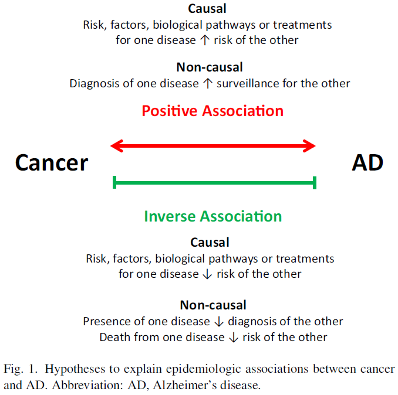

```{r setup, include=FALSE, }
options(htmltools.dir.version = FALSE)
knitr::opts_chunk$set(collapse = TRUE, fig.retina = 3, warning = FALSE,
                      message = FALSE, echo = FALSE, fig.showtext = TRUE, cache = TRUE)
library(WeightIt)
library(cobalt)
library(splines)
library(knitr)
library(kableExtra)

source(here::here("02_R", "04_direct_effect_simplified.R"))
source(here::here("02_R", "05_plots.R"))
source(here::here("02_R", "05b_plot_causes_death.R"))
table_results <- rio::import(here::here("02_R", "table_results.csv"))
table_results_bounds <- rio::import(here::here("02_R", "table_results_bounds.csv"))

```

```{r xaringan-themer, include=FALSE}
library(xaringanthemer)
style_mono_accent(
  base_color = "#011A5E",
  header_font_google = google_font("Fira Sans", "500"),
  table_row_even_background_color = "#FFFFFF",
  table_border_color = "#011A5E",
  text_font_google   = google_font("Lato", "400", "400i"),
  text_font_size = "25px"
)
```

background-image: url(./figs/erasmus.png)
background-position: 5% 95%
background-size: 25%, 15%
class: center, middle

## Dissecting the causal question underlying the association between cancer and dementia


<br> <br> <br>

.right[L. Paloma Rojas-Saunero, MD

**Epidemiology department**]

---

## Introduction

.pull-left[

Observational studies have found a protective effect of cancer diagnosis in the risk of Alzheimer´s disease or related dementias (ADRD).

These studies lead to discussions of repurposing or augmenting current cancer chemotherapeutics for ADRD
]

--

.pull-right[ 

]


.footnote[Ospina-Romero M. JAMA Network Open. 2020]

---

## Cancer diagnosis as an exposure

```{r, fig.align='center', out.width= "40%"}


```
.footnote[L. Frain et al. Alzheimer’s & Dementia. 2017]
---

.pull-left[
 
]

.pull-right[

<br><br><br>


]

.pull-right[
.footnote[Driver J. et al. Biochimica et Biophysica Acta. 2015.]
]
---

class: middle, center

## How can we conclude on causal pathways with observational data?

---

## Aims

- To progressively build a causal directed acyclic graph (DAG) which help us connect the causal question to the observable data and the assumptions we rely on to identify the effect.  

--

- To exemplify different scenarios with real data collected from the Rotterdam Study. 

--

- To describe the challenges and how they translate into the analytic decisions.

---

### Causal question

.pull-left[

What is the effect of a drug targeted to Pin1 $(D)$ in the risk of ADRD at time *t* $(Y_{t})$  compared to standard treatments?

We can imagine an RCT where middle-aged participants with signs of cognitive decline are recruited.

]

--

<br><br>

.pull-right[
```{tikz, fig.ext = 'png', echo = FALSE}
\usetikzlibrary{arrows}
\begin{tikzpicture}[node distance=2cm, auto,>=latex, scale = 0.5]
\node (p) {$D$};
\node [right of = p] (y) {$Y_{t}$};
\draw[->] (p) -- (y);
\end{tikzpicture}
```
]

---
class: middle

.pull-left[
- The drug is not available yet, but we have better chances of having Pin1 expression as a biomarker in a closer future.

- This biomarker could be measured in stored blood samples in a cohort study

- We can set a threshold for _Pin1 over-expression_ = $P$

- Since this is within an observational setting we will have to address confounding $(L)$

]

.pull-right[
```{tikz, fig.ext = 'png', echo = FALSE}
\usetikzlibrary{arrows}
\begin{tikzpicture}[node distance=2cm, auto,>=latex, scale = 0.5]
\node (p) {$P$};
\node [below of = p, yshift = 1cm, xshift = -1cm](l) {$L$};
\node [right of = p] (y) {$Y_{t}$};
\draw[->] (l) -- (p);
\draw[->, violet] (p) -- (y);
\draw[->] (l) -- (y);
\end{tikzpicture}
```
]

---

class: middle

.pull-left[

- Pin1 over-expression stimulates tumor growth

- Tumor growth leads to cancer diagnosis

- Cancer diagnosis $(P^*)$ represents a proxy for $P$

- We are assuming that the captured effect of $P^*$ and $Y_{t}$ is only through $P$
]

.pull-right[
```{tikz, fig.ext = 'png', echo = FALSE, fig.cap = ""}
\usetikzlibrary{arrows}
\begin{tikzpicture}[node distance=2cm, auto,>=latex, scale = 0.5]
\node (p) {$P$};
\node [below of = p, yshift = 1cm, xshift = -1cm](l) {$L$};
\node [above of = p, yshift = -1cm](pstar) {$P^*$};
\node [right of = p] (y) {$Y_{t}$};
\draw[->, violet] (p) -- (pstar);
\draw[->, violet] (p) -- (y);
\draw[->] (l) -- (p);
\draw[->] (l) -- (y);

\end{tikzpicture}
```
]

???

Not everyone who had Pin1 over-expression will be diagnosed with cancer by late-midlife, but in late-life.

---
class:middle

.pull-left[

- In the cohort setting people will develop cancer over time

- You need to survive long enough to have a cancer diagnosis $(D_k = 0)$


]

.pull-right[
```{tikz, fig.ext = 'png', echo = FALSE}
\usetikzlibrary{arrows}
\begin{tikzpicture}[node distance=2cm, auto,>=latex, scale = 0.5]
\node (p) {$P_0$};
\node [right of = p] (d) {$D_{k} = 0$};
\node [right of = d] (pstar) {$P^*_{k+1}$};
\draw[->] (p) -- (d);
\draw[->, violet] (p) to [out=45,in=135, looseness=0.4] (pstar);
\draw[->] (d) -- (pstar);
\end{tikzpicture}
```
]

---

class:middle

.pull-left[

- We need to isolate the effect of $P$ in $P^*$ and mimic a setting where over time those who died had would have had the same risk of developing cancer over time based on additional information $C_1, C_2$ 

]

.pull-right[
```{tikz, fig.ext = 'png', echo = FALSE}
\usetikzlibrary{arrows}
\begin{tikzpicture}[node distance=2cm, auto,>=latex, scale = 0.5]
\node (p) {$P_0$};
\node [right of = p] (d) {$D_{k} = 0$};
\node [right of = d] (pstar) {$P^*_{k+1}$};
\node [below of = p, yshift = 1cm, xshift = -1cm](l) {$C_1$};
\node [below of = d, yshift = 1cm, xshift = 1cm](c) {$C_2$};
\draw[->] (p) -- (d);
\draw[->, violet] (p) to [out=45,in=135, looseness=0.4] (pstar);
\draw[->] (d) -- (pstar);
\draw[->] (l) -- (p);
\draw[->] (l) -- (d);
\draw[->] (c) -- (pstar);
\draw[->] (c) -- (d);
\end{tikzpicture}
```
]

---
class: middle, center

## Overview of the causal question and assumptions related to death as a competing event of ADRD

---
class: middle

.pull-left[

- We are interested in the direct effect of cancer in dementia, not mediated through death

- We can consider death as a censoring event that could be prevented

- We rely on the independent censoring assumption

]

.pull-right[
```{tikz, fig.ext = 'png', echo = FALSE, fig.cap = ""}
\usetikzlibrary{arrows}
\begin{tikzpicture}[node distance=2cm, auto,>=latex, scale = 0.5]
\node (p) {$P$};
\node [below of = p, yshift = 1cm, xshift = -1cm](l) {$L$};
\node [above of = p, yshift = -1cm](pstar) {$P^*$};
\node [right of = p] (d) {$D_{t}$};
\node [right of = d] (y) {$Y_{t+1}$};
\draw[->, violet] (p) -- (pstar);
\draw[->] (p) -- (d);
\draw[->] (d) -- (y);
\draw[->] (l) -- (p);
\draw[->] (l) -- (y);
\draw[->, violet] (p) to [out=45,in=135, looseness=0.4] (y);
\end{tikzpicture}
```
]


---
class: middle

.pull-left[

- But we cannot consider $D_{t}$ and $Y_{t+1}$ as independent events unconditionally

- We need information on time-varying factors that increase the risk of dying and having dementia over time $C$

]

.pull-right[
```{tikz, fig.ext = 'png', echo = FALSE, fig.cap = ""}
\usetikzlibrary{arrows}
\begin{tikzpicture}[node distance=2cm, auto,>=latex, scale = 0.5]
\node (p) {$P$};
\node [below of = p, yshift = 1cm, xshift = -1cm](l) {$L$};
\node [above of = p, yshift = -1cm](pstar) {$P^*$};
\node [right of = p] (d) {$D_{t}$};
\node [right of = d] (y) {$Y_{t+1}$};
\node [below of = d, yshift = 1cm, xshift = +1cm](c) {$C$};
\draw[->, violet] (p) -- (pstar);
\draw[->] (p) -- (d);
\draw[->] (d) -- (y);
\draw[->] (l) -- (p);
\draw[->] (l) -- (y);
\draw[->] (c) -- (d);
\draw[->] (c) -- (y);
\draw[->, violet] (p) to [out=45,in=135, looseness=0.4] (y);
\end{tikzpicture}
```

]

???
In this setting death is treated as a censoring event and it can be interpreted as those who died would have the same risk of developing dementia if prevented from dying than those who remained alive and free of dementia at a given time point, conditional on shared causes of dementia and death

---
class: middle

.pull-left[

- We also have to acknowledge that cancer diagnosis affects death through other mechanisms independent of $P$

]

.pull-right[
```{tikz, fig.ext = 'png', echo = FALSE, fig.cap = ""}
\usetikzlibrary{arrows}
\begin{tikzpicture}[node distance=2cm, auto,>=latex, scale = 0.5]
\node (p) {$P$};
\node [below of = p, yshift = 1cm, xshift = -1cm](l) {$L$};
\node [above of = p, yshift = -1cm](pstar) {$P^*$};
\node [right of = p] (d) {$D_{t}$};
\node [right of = d] (y) {$Y_{t+1}$};
\node [below of = d, yshift = 1cm, xshift = +1cm](c) {$C$};
\draw[->, violet] (p) -- (pstar);
\draw[->] (p) -- (d);
\draw[->] (pstar) -- (d);
\draw[->] (d) -- (y);
\draw[->] (l) -- (p);
\draw[->] (l) -- (y);
\draw[->] (c) -- (d);
\draw[->] (c) -- (y);
\draw[->, violet] (p) to [out=45,in=135, looseness=0.4] (y);
\end{tikzpicture}
```

]


---
class: middle, center


```{tikz, fig.ext = 'png', echo = FALSE, fig.cap = ""}
\usetikzlibrary{arrows}
\begin{tikzpicture}[node distance=2cm, auto,>=latex, scale = 0.5]
\node (p) {$P$};
\node [below of = p, yshift = 1cm, xshift = -1cm](l) {$L$};
\node [right of = p] (dp) {$D_t$};
\node [right of = dp] (pstar) {$P*_t$};
\node [right of = pstar] (d) {$D_{t+1}$};
\node [right of = d] (y) {$Y_{t+1}$};
\node [above of = dp, yshift = -1cm, xshift = +1cm](c) {$C_1$};
\node [above of = d, yshift = -1cm, xshift = +1cm](cd) {$C_2$};
\draw[->] (p) -- (dp);
\draw[->] (dp) -- (pstar);
\draw[->, violet] (p) to [out=-45,in=-135, looseness=0.3] (pstar);
\draw[->] (pstar) -- (d);
\draw[->] (p) to [out=-45,in=-135, looseness=0.3] (d);
\draw[->, violet] (p) to [out=-45,in=-135, looseness=0.3] (y);
\draw[->] (d) -- (y);
\draw[->] (l) -- (p);
\draw[->] (l) to [out=0,in=270, looseness=0.4] (y);
\draw[->] (c) -- (dp);
\draw[->] (c) -- (pstar);
\draw[->] (cd) -- (d);
\draw[->] (cd) -- (y);
\end{tikzpicture}
```

...all the pieces together...

---
## Application to the Rotterdam Study

We conduct an analysis of the cancer-ADRD association that is structured to the best of the available data’s abilities to inform the possible effect of Pin1 on all cause-dementia

--

- Participants between 60 and 70 years old at study entry
- Without history of cancer diagnosis and dementia
- Data on cancer diagnosis and dementia diagnosis is measured through follow-up and linkage with national registries.
- Date and cause of death was collected on a weekly basis via municipal population registries
- Data on covariates is measured repeatedly over visits and through linkage to EHR


---

### Methods

We considered 3 scenarios to define Pin1 over-expression:

--

- _"Cancer ever vs. never"_ as if Pin1 measurement and cancer diagnosis happened at the same time if looked retrospectively. 

--

- Cancer as a _"time-varying"_ exposure independent of death. 

--

- _"Time to cancer diagnosis"_ as the proxy for Pin1 over-expression.

--

We used inverse probability treatment weighting (IPTW) to address confounding. 

---

### Methods

- To compare the risk of dementia at 20 years of follow-up, in a setting were death could have been prevented, we compared the complement of a weighted Kaplan-Meier survival estimator in participants with incident cancer vs. no incident of cancer with time indexed in years.

--

- The weights in this case are time-varying by follow-up year, defined as a product of the time-fixed IPT weights above and a year-specific inverse probability of censoring by death weights (IPC).  

--

- For an individual still alive in year _t_, the time _t_ IPC weight is the product of the inverse probability of surviving in each year prior to _t_, conditional on measured common causes of death and dementia. For an individual who has died by time t, the year t IPC weight is zero.

--

- We additionally calculated the direct effect considering death as an unconditional independent censoring event (as if there were no arrows from {C} to $D_{t}$ and $Y_{t+1}$) for an illustrative purpose.

---

### Methods

Since the independent censoring assumption is untestable, we can consider extreme scenarios of independence and fit Peterson upper and lower bounds.

--

1) Total independence, that refers to an scenario were those who died would never develop dementia (lower bound).
  + Aalen-Johansen estimator treating death as a competing event.

--

2) Complete dependency, that refers to an scenario where those who died would have dementia prior to death (upper bound). 
  + The Kaplan Meier estimator for the combined outcome of dementia or death.


---
### Results

.pull-left[
```{r, echo = FALSE}
plot_distribution +
    theme_xaringan()
```
]

--

.pull-right[
- 24% had cancer, the median age of cancer diagnosis was 73 (IQR: 69-77). 

- Among participants with cancer, 6% had dementia and 63% (n = 549) died.

- Among participants free of cancer diagnosis, 14% had dementia and 23% died.
]
---
### Results

*Weight assessment for cancer diagnosis*

.center[
```{r}
love.plot(w.out1) +
  theme_minimal() +
  theme(legend.position = "bottom") +
  scale_color_manual(values = c("#011A5E", "#e4a803"))

```
]

---
### Results

*Weight assessment for death including baseline covariates*

.center[
```{r}
love.plot(w.out_death) +
  theme_minimal() +
  theme(legend.position = "bottom") +
  scale_color_manual(values = c("#011A5E", "#e4a803"))
```
]
---
### Cancer as: never vs. ever

.pull-left[
```{r}
plot_1b
```

]

--

.pull-right[
```{r}
plot_1c
```

]

---
### Cancer as time-varying exposure

.pull-left[
```{r}
plot_2b
```

]

--

.pull-right[
```{r}
plot_2c
```

]

---

### Time to cancer

.pull-left[
```{r}
plot_3a
```

]

--

.pull-right[
```{r}
plot_3b
```

]
---
### Results

<br> 

.center[
```{r, echo = FALSE}
tb <- table_results %>%
  select(-c(3, 4)) %>%
  rename(RD = rd, RR = rr, `HR (95%CI)` = hr)

tb %>% kbl() %>%
kable_styling(bootstrap_options = c("striped", "hover"))
```
]
---

### Extreme scenarios of independency

.pull-left[
```{r, echo = FALSE}
table_results_bounds %>% 
  select(-3, -4, - 6) %>%
    pivot_wider(names_from = c(model),
              values_from = rd) %>%
  ggplot(aes(
    y = Proxy,
    x = `IPTW + IPCW`,
    xmin = `Lower bound`,
    xmax = `Upper bound`
  )) +
  geom_vline(xintercept = 0,
             color = "#E69F00",
             size = 1.2) +
  geom_pointrange(shape = 15,
                  color = "#0072B2") +
  geom_errorbar(width = 0.2, color = "#0072B2") +
  labs(x = "Risk difference",
       y = NULL) + 
  theme_xaringan()
```
]

--

.pull-right[
```{r, echo = FALSE}
table_results_bounds %>% 
  select(-3, -4, - 5) %>%
    pivot_wider(names_from = c(model),
              values_from = rr) %>%
  ggplot(aes(
    y = Proxy,
    x = `IPTW + IPCW`,
    xmin = `Lower bound`,
    xmax = `Upper bound`
  )) +
  geom_vline(xintercept = 1,
             color = "#E69F00",
             size = 1.2) +
  geom_pointrange(shape = 15,
                  color = "#0072B2") +
  geom_errorbar(width = 0.2, color = "#0072B2") +
  labs(x = "Risk Ratio",
       y = NULL) + 
   scale_x_continuous(
    trans = "log10",
    # breaks = seq(0.7, 1.2, by = 0.1)
  ) +
  theme_xaringan()
```
]

---

### Causes of death

```{r, echo = FALSE, fig.align='center', fig.width = 14}
causes_death + 
      theme_xaringan(text_font_size = 20,
                       title_font_size = 20) +
     theme(legend.position = "right")

```

---

### Thoughts so far...

- There big gap between what we measure and analyze as exposures, and what we truly want to study. 

--

- The process of connecting our real question to the data help us identify the structure that will later represent the analytic decisions and assumptions.

--

- When death is a competing event, prior to choosing the estimator we need to define what is the estimand of interest and be explicit about the assumptions and interpretations.

--

- Descriptive information, such as % of people who died in each arm should be always presented.

---

### Questions

- How can I make my points clear for a wide audience?

- What to add, what to remove?

