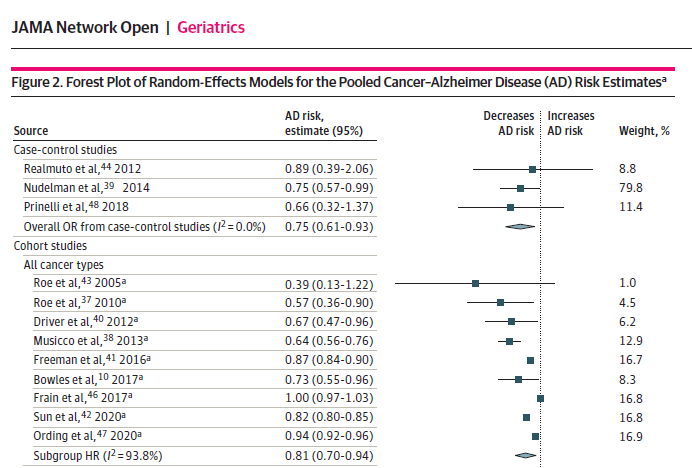
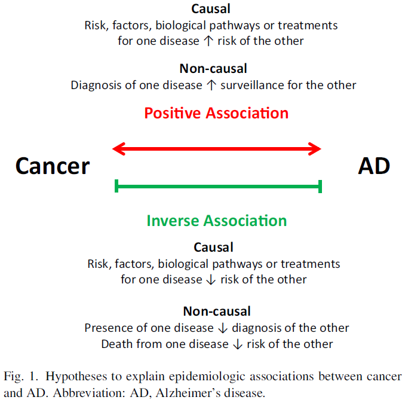
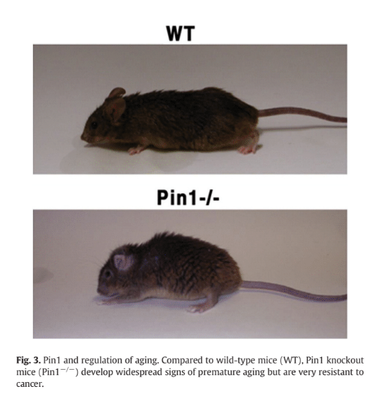
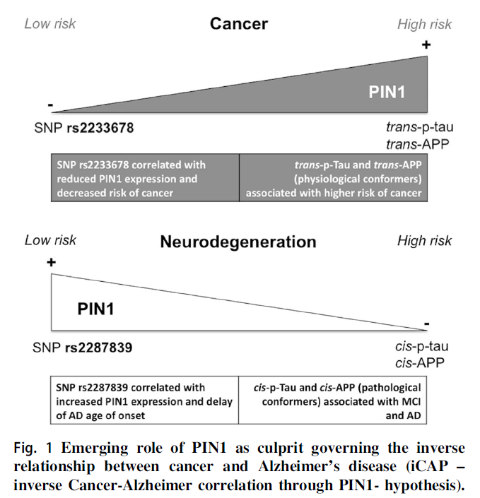

```{r setup, include=FALSE}
options(htmltools.dir.version = FALSE)
knitr::opts_chunk$set(warning = FALSE, message = FALSE, echo = FALSE, fig.showtext = TRUE, cache = TRUE)

library(splines)
library(knitr)
library(kableExtra)

load(here::here("03_figs", "plots.RData"))
source(here::here("02_R", "05_plots.R"))
source(here::here("02_R", "05b_plot_causes_death.R"))
hr_results <- rio::import(here::here("02_R", "hr_results.csv"))
rd_results_ever <- rio::import(here::here("02_R", "rd_results_ever.csv"))
rd_results_tv <- rio::import(here::here("02_R", "rd_results_tv.csv"))
table_results_bounds <- rio::import(here::here("02_R", "table_results_bounds.csv")) %>%
  select(1,2,rr) %>%
  filter(Proxy != "Time to cancer",
         model != "IPTW + IPCW") %>%
  pivot_wider(names_from = model, values_from = rr)

rr <- rd_results_ever %>%
  bind_rows(rd_results_tv) %>%
  select(Proxy, model, rr, conf) %>%
  pivot_wider(names_from = conf,
              values_from = rr) %>%
  mutate(contrast = "Risk Ratio") %>%
  rename(conf.high = conf.higher) %>%
  mutate(Proxy = str_replace(Proxy, "Time-varing", "Time-varying"))

results <- hr_results %>%
  mutate(contrast = "Hazard Ratio") %>%
  filter(Proxy != "Time to cancer") %>%
  mutate(Proxy = ifelse(
    Proxy == "Ever vs. Never", "Ever vs. never", "Time-varying")) %>%
  bind_rows(rr) %>%
  mutate(Proxy = str_to_sentence(Proxy))
```

```{r xaringan-themer, include=FALSE}
library(xaringanthemer)
style_mono_accent(
  base_color = "#011A5E",
  header_font_google = google_font("Fira Sans", "500"),
  table_row_even_background_color = "#FFFFFF",
  table_border_color = "#011A5E",
  text_font_google   = google_font("Lato", "400", "400i"),
  text_font_size = "30px"
)
```

background-image: url(./figs/erasmus.png)
background-position: 5% 95%
background-size: 25%, 15%
class: center, middle

## Dissecting the causal question underlying the association between cancer and dementia


<br> <br> <br>

.right[L. Paloma Rojas-Saunero, MD

**Epidemiology department**]

---

## Introduction

.pull-left[

Observational studies have found a protective effect of cancer diagnosis in the risk of Alzheimer´s disease or related dementias (ADRD).

These studies lead to discussions of repurposing or augmenting current cancer chemotherapeutics for ADRD
]

--

.pull-right[ 

]


.footnote[Ospina-Romero M. JAMA Network Open. 2020]

---

## Cancer diagnosis as an exposure

```{r, fig.align='center', out.width= "40%"}


```
.footnote[L. Frain et al. Alzheimer’s & Dementia. 2017]

---

.pull-left[

Driver J. et al. (2015)
]

--

.pull-right[


<br>
Lanni C. et al. (2021)
]

---

class: middle, center

## How can identify a causal pathways like Pin1 with real-world data?

---

## Aims

- To build a causal directed acyclic graph (DAG) which help us connect the causal question to real-world data on cancer and ADRD and spell out the assumptions we need to identify the effect.  

--

- To describe the challenges and how they translate into the analytic decisions.

--

- To exemplify this process in an application using data from the Rotterdam Study.

---
### Pin1 targeted-drug and ADRD diagnosis

```{tikz, echo = FALSE}
\usetikzlibrary{arrows}
\begin{tikzpicture}[node distance=2cm]
\node (p) {$P$};
\node [gray!20,above of = p, yshift = -0.8cm, xshift = -1cm](l) {$L$};
\node [gray!20, below of = p, yshift = 1cm] (pstar) {$P^*_{t-1}$};
\node [gray!20, right of = p] (dp) {$D_t$};
\node [gray!20, right of = dp] (p2) {$P_t$};
\node [gray!20, below of = p2, yshift = 1cm] (pstar2) {$P^*_t$};
\node [gray!20, right of = p2] (dp2) {$D_{t+1}$};
\node [right of = dp2] (y) {$Y_{t+1}$};
\node [gray!20, below of = dp2, yshift = 1cm, xshift = +1cm](cd) {$C$};
\draw[->, gray!20] (p) to (pstar);
\draw[->, gray!20] (p2) to (pstar2);
\draw[->, gray!20] (l) -- (p);
\draw[->, gray!20] (l) -- (p2);
\draw[->, gray!20] (l) to (dp);
\draw[->, gray!20] (l) to [out=0,in=90, looseness=0.4] (dp2);
\draw[->, gray!20] (l) to [out=0,in=90, looseness=0.4] (y);
\draw[->, gray!20] (pstar) -- (dp);
\draw[->, gray!20] (pstar2) -- (dp2);
\draw[->, gray!20] (dp) to [out=-45,in=-135, looseness=0.3] (dp2);
\draw[->, gray!20] (dp) -- (p2);
\draw[->, gray!20] (dp2) -- (y);
\draw[->, gray!20] (cd) -- (dp2);
\draw[->, gray!20] (cd) -- (y);
\draw[->, gray!20, semithick] (p2) to [out=+45,in=+135, looseness=0.3] (y);
\draw[->, semithick] (p) to [out=+45,in=+135, looseness=0.3] (y);
\end{tikzpicture}
```

$P$ = Pin1 targeted-drug; $Y_{t+1}$ = Dementia diagnosis

???
In a setting where this hypothetical Pin1-targeting drug was developed, the best way to understand its effect on dementia risk would be to have a well-conducted randomized trial in which we randomize eligible participants in late midlife (e.g., ages 50-60 years) to receive this drug or not, and closely monitor ADRD over a lengthy follow-up.

---
### Pin1 expression as biomarker

```{tikz, echo = FALSE}
\usetikzlibrary{arrows}
\begin{tikzpicture}[node distance=2cm]
\node (p) {$P_{t-1}$};
\node [above of = p, yshift = -0.8cm, xshift = -1cm](l) {$L$};
\node [gray!20, below of = p, yshift = 1cm] (pstar) {$P^*_{t-1}$};
\node [gray!20, right of = p] (dp) {$D_t$};
\node [gray!20, right of = dp] (p2) {$P_t$};
\node [gray!20, below of = p2, yshift = 1cm] (pstar2) {$P^*_t$};
\node [gray!20, right of = p2] (dp2) {$D_{t+1}$};
\node [right of = dp2] (y) {$Y_{t+1}$};
\node [gray!20, below of = dp2, yshift = 1cm, xshift = +1cm](cd) {$C$};
\draw[->, gray!20] (p) to (pstar);
\draw[->, gray!20] (p2) to (pstar2);
\draw[->] (l) -- (p);
\draw[->, gray!20] (l) -- (p2);
\draw[->, gray!20] (l) to (dp);
\draw[->, gray!20] (l) to [out=0,in=90, looseness=0.4] (dp2);
\draw[->] (l) to [out=0,in=90, looseness=0.4] (y);
\draw[->, gray!20] (pstar) -- (dp);
\draw[->, gray!20] (pstar2) -- (dp2);
\draw[->, gray!20] (dp) to [out=-45,in=-135, looseness=0.3] (dp2);
\draw[->, gray!20] (dp) -- (p2);
\draw[->, gray!20] (dp2) -- (y);
\draw[->, gray!20] (cd) -- (dp2);
\draw[->, gray!20] (cd) -- (y);
\draw[->, gray!20, semithick] (p2) to [out=+45,in=+135, looseness=0.3] (y);
\draw[->, semithick] (p) to [out=+45,in=+135, looseness=0.3] (y);
\end{tikzpicture}
```

$P_{t-1}$ = Pin1 over-expression; $Y_{t+1}$ = Dementia diagnosis; $L$ = Shared causes of $P_{t-1}$ and $Y_{t+1}$

???
Since this drug is not currently available, at best we can use observational data on Pin1 expression measurements. For example, suppose that a biomarker test was available to measure Pin1 and we measured this biomarker from (stored) baseline blood samples in a population based-cohort that recruited participants in late midlife. In the observational setting, confounding could explain the observed association between Pin1 and ADRD. 

---
### Cancer diagnosis as the proxy of Pin1

```{tikz, echo = FALSE}
\usetikzlibrary{arrows}
\begin{tikzpicture}[node distance=2cm]
\node (p) {$P_{t-1}$};
\node [above of = p, yshift = -0.8cm, xshift = -1cm](l) {$L$};
\node [below of = p, yshift = 1cm] (pstar) {$P^*_{t-1}$};
\node [gray!20, right of = p] (dp) {$D_t$};
\node [right of = dp] (p2) {$P_t$};
\node [below of = p2, yshift = 1cm] (pstar2) {$P^*_t$};
\node [gray!20, right of = p2] (dp2) {$D_{t+1}$};
\node [right of = dp2] (y) {$Y_{t+1}$};
\node [gray!20, below of = dp2, yshift = 1cm, xshift = +1cm](cd) {$C$};
\draw[->] (p) to (pstar);
\draw[->] (p2) to (pstar2);
\draw[->] (l) -- (p);
\draw[->] (l) -- (p2);
\draw[->] (l) to [out=0,in=90, looseness=0.4] (y);
\draw[->, gray!20] (l) to (dp);
\draw[->, gray!20] (l) to [out=0,in=90, looseness=0.4] (dp2);
\draw[->, gray!20] (dp) -- (p2);
\draw[->, gray!20] (pstar) -- (dp);
\draw[->, gray!20] (pstar2) -- (dp2);
\draw[->, gray!20] (dp) to [out=-45,in=-135, looseness=0.3] (dp2);
\draw[->, gray!20] (dp2) -- (y);
\draw[->, gray!20] (cd) -- (dp2);
\draw[->, gray!20] (cd) -- (y);
\draw[->, semithick] (p) to [out=+45,in=+135, looseness=0.3] (y);
\draw[->, semithick] (p2) to [out=+45,in=+135, looseness=0.3] (y);
\end{tikzpicture}
```


$P_{t-1}$ and $P_{t}$= Pin1 over-expression; $P^*_{t-1}$ and $P^*_t$ = Cancer diagnosis; $Y_{t+1}$ = Dementia diagnosis; $L$ = Shared causes;

???
But Pin1 is not an available biomarker for population-based research, so at best we can only rely on a proxy for it. Because Pin1 over-expression is present in tumors, and tumors are only measured through diagnosis, we may use cancer as a proxy. 
However, unlike measuring Pin1 at the same time to all participants cancer diagnosis is a time-varying process. Although this means we would measure the association between cancer diagnosis over time and ADRD in the observed data, we are assuming that the captured effect is only through the pathway that involves Pin1 expression over time.

---
### Time-varying cancer diagnosis and inmortal-time bias

```{tikz, echo = FALSE}
\usetikzlibrary{arrows}
\begin{tikzpicture}[node distance=2cm]
\node (p) {$P_{t-1}$};
\node [above of = p, yshift = -0.8cm, xshift = -1cm](l) {$L$};
\node [below of = p, yshift = 1cm] (pstar) {$P^*_{t-1}$};
\node [right of = p] (dp) {$D_t$};
\node [right of = dp] (p2) {$P_t$};
\node [below of = p2, yshift = 1cm] (pstar2) {$P^*_t$};
\node [gray!20, right of = p2] (dp2) {$D_{t+1}$};
\node [right of = dp2] (y) {$Y_{t+1}$};
\node [gray!20, below of = dp2, yshift = 1cm, xshift = +1cm](cd) {$C$};
\draw[->] (p) to (pstar);
\draw[->] (p2) to (pstar2);
\draw[->] (l) -- (p);
\draw[->] (l) -- (p2);
\draw[->] (l) to (dp);
\draw[->] (dp) -- (p2);
\draw[->, gray!20] (l) to [out=0,in=90, looseness=0.4] (dp2);
\draw[->] (l) to [out=0,in=90, looseness=0.4] (y);
\draw[->, gray!20] (pstar) -- (dp);
\draw[->, gray!20] (pstar2) -- (dp2);
\draw[->, gray!20] (dp) to [out=-45,in=-135, looseness=0.3] (dp2);
\draw[->, gray!20] (dp2) -- (y);
\draw[->, gray!20] (cd) -- (dp2);
\draw[->, gray!20] (cd) -- (y);
\draw[->, semithick] (p2) to [out=+45,in=+135, looseness=0.3] (y);
\draw[->, semithick] (p) to [out=+45,in=+135, looseness=0.3] (y);
\end{tikzpicture}
```


$P_{t-1}$ and $P_{t}$= Pin1 over-expression; $P^*_{t-1}$ and $P^*_t$ = Cancer diagnosis; $Y_{t+1}$ = Dementia diagnosis; $L$ = Shared causes; $D_t$ = Death prior to $P_{t}$

???
A challenge that arises by defining cancer diagnosis as the proxy for Pin1 is defining the time zero, the time where follow-up and screening for ADRD would begin after having the exposure measured. The eligibility criteria to join the study may not align with the time cancer diagnosis is measured. This situation may introduce inmortal-time bias. A participant needs to survive to have a cancer diagnosis over time.

This problem is avoided by recognizing the time-varying nature of cancer diagnosis. And previous studies have defined cancer as a tv or time dependant exposure, though only adjusted for baseline covariates.

The price we pay with this approximation is that implicitly, this means that Pin1 would over-express at the time of cancer diagnosis, which is biologically implausible.

---
### Death as a competing event of ADRD

--
```{tikz, echo = FALSE}
\usetikzlibrary{arrows}
\begin{tikzpicture}[node distance=2cm]
\node [gray!20](p) {$P_{t-1}$};
\node [gray!20, above of = p, yshift = -0.8cm, xshift = -1cm](l) {$L$};
\node [gray!20, below of = p, yshift = 1cm] (pstar) {$P^*_{t-1}$};
\node [gray!20, right of = p] (dp) {$D_t$};
\node [right of = dp] (p2) {$P_t$};
\node [gray!20, below of = p2, yshift = 1cm] (pstar2) {$P^*_t$};
\node [right of = p2] (dp2) {$D_{t+1}$};
\node [right of = dp2] (y) {$Y_{t+1}$};
\node [below of = dp2, yshift = 1cm, xshift = +1cm](cd) {$C$};
\draw[->, gray!20] (p) to (pstar);
\draw[->, gray!20] (l) -- (p);
\draw[->, gray!20] (l) to (dp);
\draw[->, gray!20] (pstar) -- (dp);
\draw[->, gray!20] (dp) to [out=-45,in=-135, looseness=0.3] (dp2);
\draw[->, gray!20] (dp) -- (p2);
\draw[->, semithick, gray!20] (p) to [out=+45,in=+135, looseness=0.3] (y);
\draw[->, gray!20] (p2) to (pstar2);
\draw[->] (dp2) -- (y);
\draw[->] (cd) -- (dp2);
\draw[->] (cd) -- (y);
\draw[->, gray!20] (l) -- (p2);
\draw[->, gray!20] (l) to [out=0,in=90, looseness=0.4] (dp2);
\draw[->, gray!20] (l) to [out=0,in=90, looseness=0.4] (y);
\draw[->, gray!20] (pstar2) -- (dp2);
\draw[->, semithick] (p2) to [out=+45,in=+135, looseness=0.3] (y);
\end{tikzpicture}
```

$P_{t}$= Pin1 targeted drug; $D_{t+1}$ = Death prior to $Y_{t+1}$; $Y_{t+1}$ = Dementia diagnosis; $C$ = shared causes

???
Let's step back for a minute and imagine that we had indeed randomized participants to pin1 drug.
Even in the context of an RCT, death will act as a competing event since it prevents dementia at future time-points. Talk about the total effect.
---
###  Death as a competing event of ADRD

```{tikz, echo = FALSE}
\usetikzlibrary{arrows}
\begin{tikzpicture}[node distance=2cm]
\node [gray!20](p) {$P_{t-1}$};
\node [above of = p, yshift = -0.8cm, xshift = -1cm](l) {$L$};
\node [gray!20, below of = p, yshift = 1cm] (pstar) {$P^*_{t-1}$};
\node [gray!20, right of = p] (dp) {$D_t$};
\node [right of = dp] (p2) {$P_t$};
\node [below of = p2, yshift = 1cm] (pstar2) {$P^*_t$};
\node [right of = p2] (dp2) {$D_{t+1}$};
\node [right of = dp2] (y) {$Y_{t+1}$};
\node [below of = dp2, yshift = 1cm, xshift = +1cm](cd) {$C$};
\draw[->, gray!20] (p) to (pstar);
\draw[->, gray!20] (l) -- (p);
\draw[->, gray!20] (l) to (dp);
\draw[->, gray!20] (pstar) -- (dp);
\draw[->, gray!20] (dp) to [out=-45,in=-135, looseness=0.3] (dp2);
\draw[->, gray!20] (dp) -- (p2);
\draw[->, semithick, gray!20] (p) to [out=+45,in=+135, looseness=0.3] (y);
\draw[->] (p2) to (pstar2);
\draw[->] (dp2) -- (y);
\draw[->] (cd) -- (dp2);
\draw[->] (cd) -- (y);
\draw[->] (l) -- (p2);
\draw[->] (l) to [out=0,in=90, looseness=0.4] (dp2);
\draw[->] (l) to [out=0,in=90, looseness=0.4] (y);
\draw[->] (pstar2) -- (dp2);
\draw[->, semithick] (p2) to [out=+45,in=+135, looseness=0.3] (y);
\end{tikzpicture}
```

???
Talk about the issue with total effect when we look at the cancer dx.
Talk about separable effects and the CDE

---
### Causal structure for the effect of Pin1 in ADRD using cancer diagnosis as a proxy for Pin1


```{tikz, echo = FALSE}
\usetikzlibrary{arrows}
\begin{tikzpicture}[node distance=2cm]
\node (p) {$P_{t-1}$};
\node [above of = p, yshift = -0.8cm, xshift = -1cm](l) {$L$};
\node [below of = p, yshift = 1cm] (pstar) {$P^*_{t-1}$};
\node [right of = p] (dp) {$D_t$};
\node [right of = dp] (p2) {$P_t$};
\node [below of = p2, yshift = 1cm] (pstar2) {$P^*_t$};
\node [right of = p2] (dp2) {$D_{t+1}$};
\node [right of = dp2] (y) {$Y_{t+1}$};
\node [below of = dp2, yshift = 1cm, xshift = +1cm](cd) {$C$};
\draw[->] (p) to (pstar);
\draw[->] (l) -- (p);
\draw[->] (l) to (dp);
\draw[->] (pstar) -- (dp);
\draw[->] (dp) to [out=-45,in=-135, looseness=0.3] (dp2);
\draw[->] (dp) -- (p2);
\draw[->, semithick] (p) to [out=+45,in=+135, looseness=0.3] (y);
\draw[->] (p2) to (pstar2);
\draw[->] (dp2) -- (y);
\draw[->] (cd) -- (dp2);
\draw[->] (cd) -- (y);
\draw[->] (l) -- (p2);
\draw[->] (l) to [out=0,in=90, looseness=0.4] (dp2);
\draw[->] (l) to [out=0,in=90, looseness=0.4] (y);
\draw[->] (pstar2) -- (dp2);
\draw[->, semithick] (p2) to [out=+45,in=+135, looseness=0.3] (y);
\end{tikzpicture}
```

---
### And there is more we could add...

<br>
.pull-left[


]

--

<br>

- Time-varying confounding loops

- Error terms for cancer diagnosis 

- Measurement and error term for ADRD

- Differential or dependent error structures

---
### Application to the Rotterdam Study

- Participants between 60 and 70 years old at study entry

- Without history of cancer diagnosis and dementia at study entry

--

- Cancer diagnosis and dementia diagnosis is measured through follow-up and linkage with national registries.

- Date and cause of death was collected on a weekly basis via municipal population registries

- Data on covariates is measured repeatedly over visits and through linkage to EHR


---
### Methods

We considered 2 scenarios to define Pin1 over-expression:

--

- "Cancer ever vs. never" to replicate previous studies (such as Driver 2012)

--

- Pin1 and cancer diagnosis as a time-varying exposure

--

20 years of follow-up or up to time of death/ADRD

---
### Methods

- Inverse probability treatment weights to address confounding (IPTW)
  
  + Time-varying cancer diagnosis: weights represent the product of the inverse probability of being diagnosed with cancer over time conditional on time-varying covariate history.

--

- Inverse probability of censoring weights for death (IPCW)*

  + For an individual still alive in year _t_, weights represent the the product of the inverse probability of surviving in each year prior to _t_, conditional on measured common causes of death and dementia. 

.footnote[Rojas-Saunero et al. Choosing questions before methods in dementia research with competing events and causal goals.MedRxiv.2021]

---

### Methods

- Risk of dementia and risk ratios are estimated with a weighted Kaplan-Meier estimator.
--

- Assessed extreme scenarios of independence and fit upper and lower bounds:

  + Total independence: those who died would never develop dementia (lower bound). Aalen-Johanssen estimator treating death as a competing event.

  + Complete dependency: those who died would have dementia prior to death (upper bound). The KM estimator for a composite outcome
--

- Hazard ratios are estimated with a weighted Cox Proportional-Hazards Model for comparative purposes.

Peterson AV. Bounds for a joint distribution function with fixed sub distribution functions: Application to competing risks. 1976

---
### Results

.center[
```{r, echo = FALSE, fig.width= 14, fig.retina=3}
plot_distribution +
  theme(legend.position = "right",
        title = element_text(face = "bold", size = rel(1.5), color = "#011A5E"),
        axis.title.x = element_text(face = "bold", size = rel(1.5), color = "#011A5E")) +
  labs(title = "Proportion of participants in each status")
```
]

???
If we look at the proportion of participants who was in each status over follow up, we observe that dementia diagnosis becomes more frequent after age of 80, while cancer diagnosis distribution is more homogenous across life span. In yellow we observe the amount of participants who died over followup, in larger proportion compared to dementia. Last, in pink we have participants who had cancer and dementia, which represents a 6% from all participants.

---

### Results

.pull-left[
```{r, echo = FALSE, fig.retina = 3}
temp <-
  table_results_bounds %>% slice(1) %>% mutate(model = "IPTW + IPCW", contrast = "Risk Ratio") %>%
  rename(conf.low = `Lower bound`, conf.high = `Upper bound`)

results %>%
  filter(Proxy == "Ever vs. never") %>%
  mutate(model = fct_relevel(model, c("Unadjusted", "IPTW", "IPTW + IPCW"))) %>%
  ggplot(aes(
    y = contrast,
    x = point,
    xmin = conf.low,
    xmax = conf.high
  )) +
  geom_vline(xintercept = 1,
             color = "#E69F00",
             size = 1.2) +
  geom_pointrange(aes(shape = contrast), color = "#0072B2") +
  geom_errorbar(aes(group = contrast),
                width = 0.2,
                color = "#0072B2") +
  geom_point(
    data = temp,
    aes(x = conf.low),
    shape = 18,
    color = "#011A5E",
    size = 3
  ) +
  geom_point(
    data = temp,
    aes(x = conf.high),
    shape = 18,
    color = "#011A5E",
    size = 3
  ) +
  facet_grid(factor(model, levels = c("Unadjusted", "IPTW", "IPTW + IPCW")) ~
                 ., switch = "y") +
  # facet_grid(model ~., switch = "y", margins = FALSE) +
  scale_x_continuous(trans = "log10") +
  labs(
    x = NULL,
    y = NULL,
    group = NULL,
    shape = NULL,
    title = "Cancer as ever vs. never",
    subtitle = "Risk ratios \U25B2, Hazard ratios \U25CF, Bounds \U25C6" ) +
  theme(
    panel.spacing = unit(0, "lines"),
    panel.background = element_blank(),
    axis.text.y = element_blank(),
    axis.ticks.y = element_blank(),
    strip.text.y = element_text(
      face = "bold",
      size = rel(1.5),
      color = "#011A5E"
    ),
    axis.line.x = element_line(color = "#011A5E"),
    axis.text.x = element_text(size = rel(1.5), color = "#011A5E"),
    strip.background = element_blank(),
    plot.title = element_text(face = "bold", size = rel(2), color = "#011A5E"),
    plot.subtitle = element_text(face = "bold", size = rel(1.5), color = "#011A5E", hjust = 0.05),
    legend.position = "none")

```

]

???
First I will show all results related to cancer as ever vs. never.
In this graph I present three situations, unadjusted, after weighting for confounding, and after weighting for confounding and censoring for death.
In each case we have risk ratios and hazard ratios.
We observe the inverse association in these two settings, and after including weights for censoring it shifts towards above the null.
Lets recall that the model with censoring weights is our best effort to achieve the conditional independence, but if we observe the bounds that represent extreme scenarios, these bounds cross the null.


--

.pull-right[
```{r, echo = FALSE, fig.retina = 3}
temp <-
  table_results_bounds %>% slice(2) %>% mutate(model = "IPTW + IPCW", contrast = "Risk Ratio") %>%
  rename(conf.low = `Lower bound`, conf.high = `Upper bound`)

results %>%
  filter(Proxy == "Time-varying") %>%
  mutate(model = fct_relevel(model, c("Unadjusted", "IPTW", "IPTW + IPCW"))) %>%
  ggplot(aes(
    y = contrast,
    x = point,
    xmin = conf.low,
    xmax = conf.high
  )) +
  geom_vline(xintercept = 1,
             color = "#E69F00",
             size = 1.2) +
  geom_pointrange(aes(shape = contrast), color = "#0072B2") +
  geom_errorbar(aes(group = contrast),
                width = 0.2,
                color = "#0072B2") +
  geom_point(
    data = temp,
    aes(x = conf.low),
    shape = 18,
    color = "#011A5E",
    size = 3
  ) +
  geom_point(
    data = temp,
    aes(x = conf.high),
    shape = 18,
    color = "#011A5E",
    size = 3
  ) +
  facet_grid(factor(model, levels = c("Unadjusted", "IPTW", "IPTW + IPCW")) ~
                 ., switch = "y") +
  scale_x_continuous(trans = "log10") +
  labs(
    x = NULL,
    y = NULL,
    group = NULL,
    shape = NULL,
    title = "Time-varying cancer",
    subtitle = "Risk ratios \U25B2, Hazard ratios \U25CF, Bounds \U25C6" ) +
  theme(
    panel.spacing = unit(0, "lines"),
    panel.background = element_blank(),
    axis.text.y = element_blank(),
    axis.ticks.y = element_blank(),
    strip.text.y = element_text(
      face = "bold",
      size = rel(1.5),
      color = "#011A5E"
    ),
    axis.text.x = element_text(size = rel(1.5), color = "#011A5E"),
    axis.line.x = element_line(color = "#011A5E"),
    strip.background = element_blank(),
    plot.title = element_text(face = "bold", size = rel(2), color = "#011A5E"),
    plot.subtitle = element_text(face = "bold", size = rel(1.5), color = "#011A5E", hjust = 0.05),
    legend.position = "none")
```

]

???
When we define cancer as a time-varying exposure, we observe a shift towards the null prior to adjustment. An estimates and confidence shift above one by including the weights.
And again, in our best scenario to achieve conditional independence, if we look at the bounds of extreme independency and dependency, they are far apart in both sides of the null.

Please note that in all cases, we would interpret this results as if death could have been prevented.

---
### Causes of death

```{r echo = FALSE, fig.retina = 3, fig.width = 14}
causes_death + 
      theme_xaringan(text_font_size = 20,
                       title_font_size = 20) +
     theme(legend.position = "right")
```

---
### Thoughts so far...


- Being explicit about the causal mechanism is useful:

  + Helps identify sources of bias and guides analysis.

  + Opens conversations about future data collection.

--

- We need to define the estimand of interest in respect to death.

  + The direct effect relies on the independent censoring assumption.

  + Interpretation implies preventing death.

  + The separable effects can provide a clearer intuition
  
  + % of people who died in each arm should be always presented.

---
### Gracias!   Thank you!

.pull-left[

]

--
<br> 

.pull-right[

`r icons::fontawesome("paper-plane", style = "solid")` </i>&nbsp; l.rojassaunero@erasmusmc.nl </a> <br>

`r icons::fontawesome$brands$twitter` @palolili23

`r icons::fontawesome$brands$github` @palolili23

]